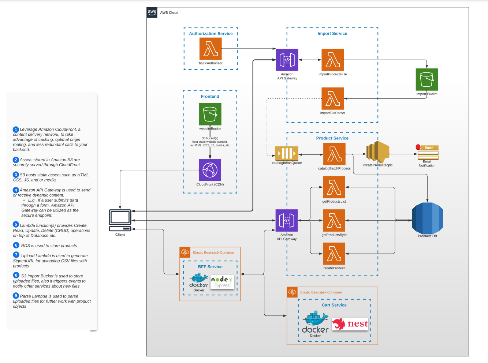

# AWS Cloud Developer
First steps in modern cloud development with AWS

## Description

🚀 Comprehensive Journey: Embark on a step-by-step journey to become an AWS Certified Developer - Associate through this course.

🛠️ 10+ Hands-on Practice Tasks: Gain practical experience working with various AWS services and technologies via over 10 hands-on tasks.

🎯 Certification Ready: Be well-prepared to pass the ["AWS Certified Developer - Associate"]((https://aws.amazon.com/certification/certified-developer-associate/)) certification and confidently apply your skills in real-world projects by the end of the course

## What you should know before starting

You should be comfortable with at least one programming language (such as Python, JavaScript, Java, or C#) and have a good understanding of basic web development concepts, including HTML, CSS, and JavaScript.

English language level: Intermediate (B1) and up.
Being able to spend at least 10 hours per week studying.

## Course Architecture

This program covers a wide range of topics according to the following 

## Course Curriculum

This program will have theory and practice on the following topics:

### Module 1 - [Cloud Introduction](01_cloud_introduction/README.md)
- Fundamental Theory about Cloud Computing
- Cloud Service Models, Cloud Deployment Models, Infrastructure-as-Code
- Monolith vs Microservices vs Serverless
- AWS Intro, Registration, Cloud Watch, IAM
- Repository structure

### Module 2 - [Serving SPA](02_serving_spa/README.md)
- AWS Simple Storage Service overview
- Services & Tools overview
- AWS CloudFront overview
- Basic overview of deployment process to CloudFront and S3
- AWS CLI overview

### Module 3 - [Serverless API](03_serverless_api/README.md)
- AWS Lambda Overview
- Introduction to Collecting logs with AWS CloudWatch
- Lambda Advanced Features and Configuration

### Module 4 - [Integration with NoSQL Database](04_integration_with_nosql_database/README.md)
- Easy way to store data in Cloud
- AWS DynamoDB and how to use it

### Module 5 - [Integration with S3](05_integration_with_s3/README.md)
- AWS S3 In-depth Introduction
- S3 Storage Classes and their Use Cases
- S3 Access Control & Encryption
- S3 Versioning, Lifecycle Management & Events
- Integration with S3 and Lambda Overview

### Module 6 - [Async Microservices Communication](06_async_microservices_communication/README.md)
- Async Messaging Overview
- AWS SQS Overview
- AWS SNS Overview
- Integration with SQS, SNS and Lambda Overview

### Module 7 - [Authorization](07_authorization/README.md)
- Authentication & Authorization overview
- Lambda Authorizer & API Gateway
- AWS Cognito overview
- Cognito User Pool
- Cognito Identity Pool

### Module 8 - [Integration with SQL Database](08_integration_with_sql_database/README.md)
- Relational Databases Theory
- SQL Overview
- Overview of AWS database offering
- AWS RDS and its engines
- Serverless functions & AWS RDS

### Module 9 - [Containerization](09_containerization/README.md)
- Docker overview
- Dockerfiles & Images
- Containers & VMs
- Docker Build Optimizations
- AWS Elastic Beanstalk overview
- AWS EB CLI

### Module 10 - [Backend For Frontend](10_backend_for_frontend/README.md)
- Backend for Frontend overview
- BFF as Pattern
- API Gateway as BFF
- AWS Elastic Beanstalk configuration